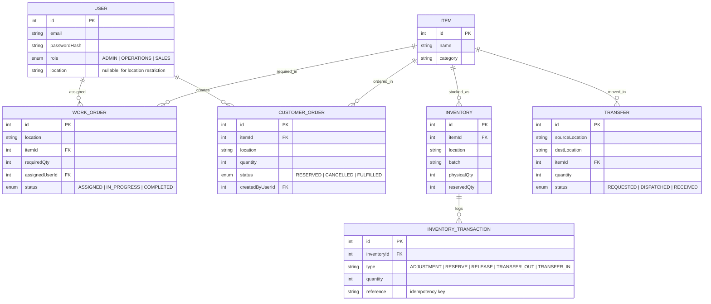

# Database Schema / ER Diagram

See `backend/prisma/schema.prisma` for the authoritative source. Diagram below
(renders on GitHub as Mermaid):

## Key design decisions

- **`availableQty` is never stored** — it is always computed as
  `physicalQty - reservedQty` at read time, so it can never drift out of sync.
- **One `Inventory` row per (item, location, batch)**, enforced by a unique
  constraint. This is also the mechanism that blocks duplicate stock lines.
- **`InventoryTransaction`** is an append-only audit log of every stock
  movement, keyed by an optional `reference` field used as an idempotency
  key to guard against duplicate transactions being replayed.
- **Reservation, dispatch, and receive are all done inside a single
  Prisma `$transaction`, using conditional `updateMany` calls** (`UPDATE ...
  WHERE <headroom still available>`). This turns "check, then write" into a
  single atomic database operation, which is what actually prevents two
  concurrent requests from over-reserving or over-transferring stock —
  a plain read-then-write in application code would have a race condition.
